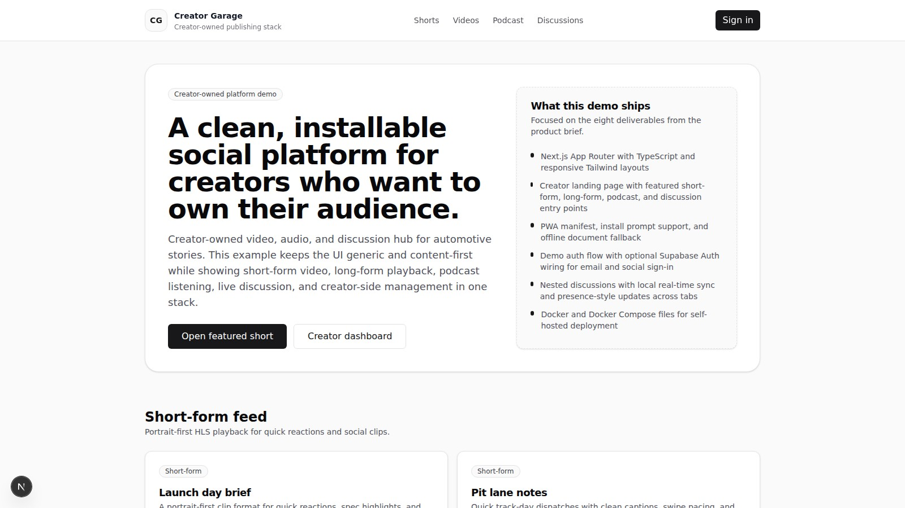
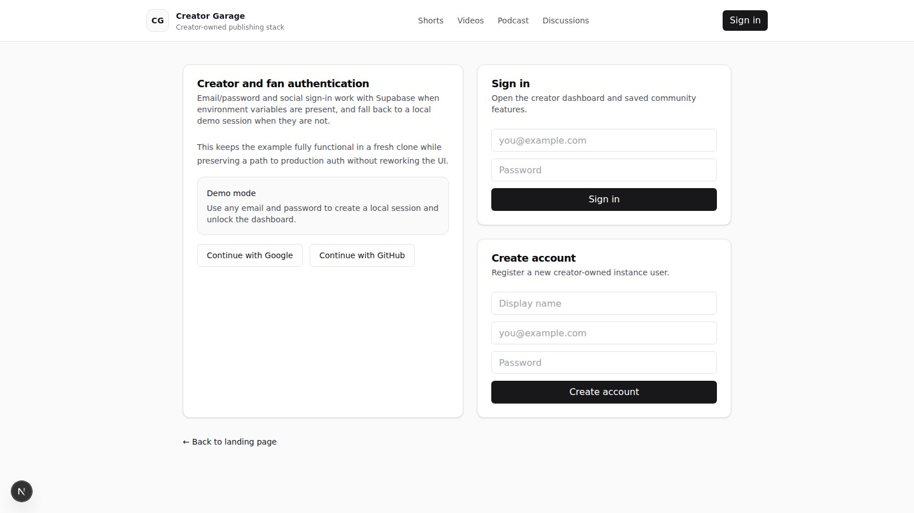
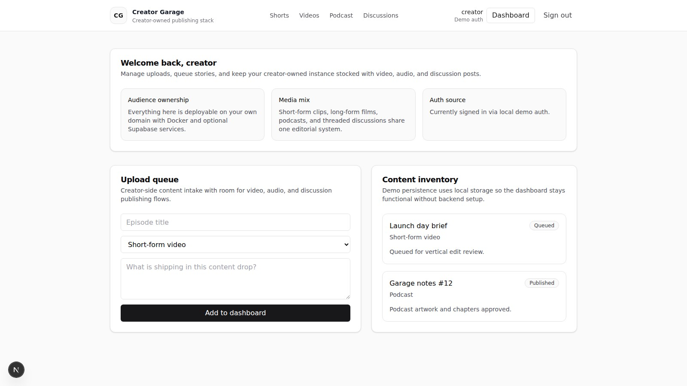
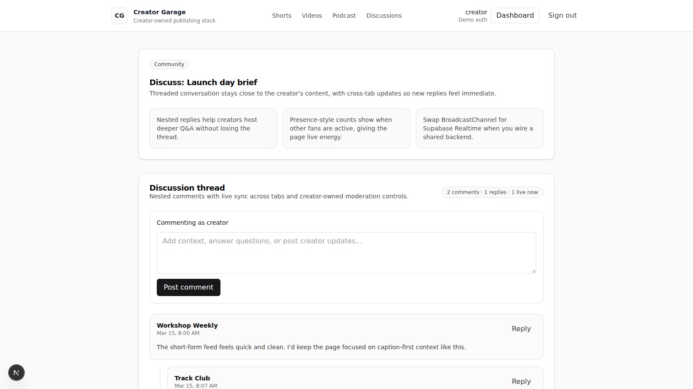
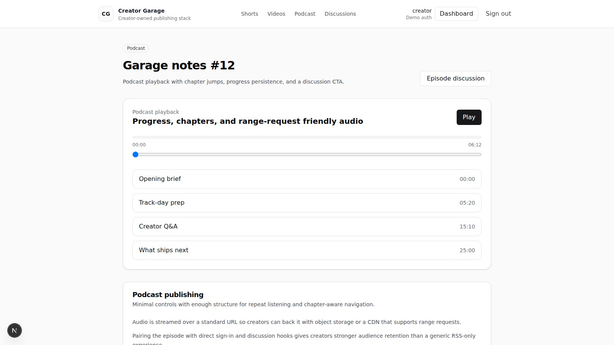
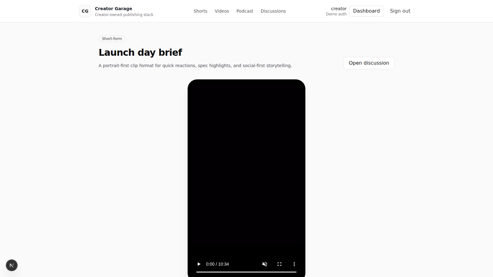
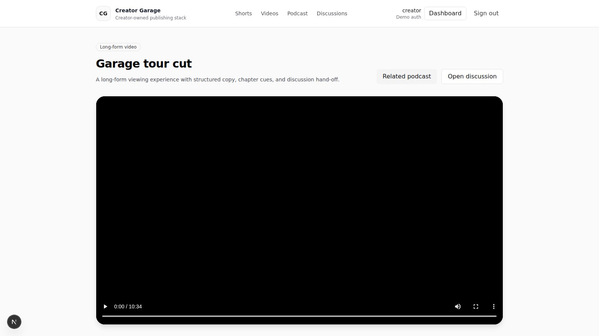
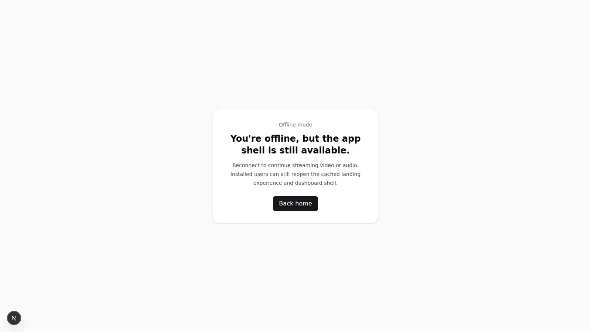

# petrol-headbook

A minimal creator-owned social platform demo built with Next.js, TypeScript, Tailwind, and default shadcn-style components.

## Included demo features

- Landing page with featured short-form video, long-form video, and podcast sections
- HLS playback for short-form and long-form pages using `hls.js`
- Podcast page with progress bar and chapter jumps
- Nested discussion threads with live cross-tab updates and presence-style counts
- Demo auth flow with optional Supabase Auth wiring for email and social sign-in
- Creator dashboard for managing example content entries
- PWA manifest, service worker registration, and offline fallback page
- Dockerfile and Docker Compose configuration for self-hosting

## Route screenshots

All screenshots below were refreshed after the system UI font update and captured at a 16:9 aspect ratio (1600×900).

### Landing page (`/`)



### Auth (`/auth`)



### Dashboard (`/dashboard`)



### Discussion thread (`/discussions/launch-day-brief`)



### Podcast (`/podcasts/garage-notes-12`)



### Short-form video (`/shorts/launch-day-brief`)



### Long-form video (`/videos/garage-tour-cut`)



### Offline (`/offline`)



## Local development

```bash
npm install
npm run dev
```

Open `http://localhost:3000`.

## Optional Supabase configuration

Set these environment variables to enable Supabase Auth instead of the built-in demo session fallback:

```bash
NEXT_PUBLIC_SUPABASE_URL=...
NEXT_PUBLIC_SUPABASE_ANON_KEY=...
NEXT_PUBLIC_SITE_URL=http://localhost:3000
```

Without those variables the app still works locally using demo auth so the platform can be evaluated from a fresh clone.

## Docker

```bash
docker compose up --build
```
